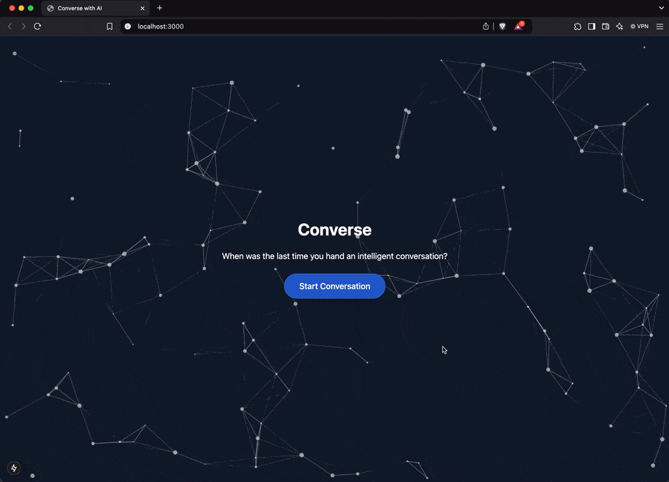

# Nene AI

Nene is a warm, Filipino family-care AI companion for elderly users ("Lola" / "Lolo"). It supports real-time voice conversations using Agora RTC + Agora Conversational AI Engine, and includes a camera “Show Nene” feature that can describe what Lola is holding and speak the answer back.



## Features

- Real-time voice conversation UI (elder-facing)
- Agora token generation + agent invite/stop flows
- TTS via Agora agent (Cartesia recommended for real-time)
- “Show Nene” (camera capture → vision description → spoken response)
- Family dashboard page at `/dashboard`

## Tech Stack

- Next.js (App Router)
- Tailwind CSS + shadcn/ui
- Agora RTC + `agora-rtc-react`
- Agora Conversational AI Engine (REST)
- Vision: Gemini via OpenRouter (fallback) and/or Google Gemini API key
- Local TTS playback for “Show Nene”: Cartesia `/tts/bytes`

## Quick Start

### 1) Install

```bash
pnpm install
```

### 2) Environment variables

Copy the example file and fill in values:

```bash
cp env.local.example .env.local
```

Minimum required variables:

**Agora**
- `NEXT_PUBLIC_AGORA_APP_ID`
- `NEXT_PUBLIC_AGORA_APP_CERTIFICATE`
- `NEXT_PUBLIC_AGORA_CONVO_AI_BASE_URL` (usually `https://api.agora.io/api/conversational-ai-agent/v2/projects`)
- `NEXT_PUBLIC_AGORA_CUSTOMER_ID`
- `NEXT_PUBLIC_AGORA_CUSTOMER_SECRET`
- `NEXT_PUBLIC_AGENT_UID` (example: `333`)

**LLM (OpenRouter)**
- `NEXT_PUBLIC_LLM_URL` (example: `https://openrouter.ai/api/v1/chat/completions`)
- `NEXT_PUBLIC_LLM_API_KEY`
- `NEXT_PUBLIC_LLM_MODEL` (example: `meta-llama/llama-3.3-70b-instruct:free`)

**TTS (Cartesia via Agora agent)**
- `NEXT_PUBLIC_TTS_VENDOR=cartesia`
- `CARTESIA_API_KEY`
- `CARTESIA_VOICE_ID`
- `CARTESIA_MODEL_ID` (default works: `sonic-2`)

**Vision**
- `GEMINI_API_KEY` (optional; direct Google endpoint)
- `VISION_MODEL` (optional; OpenRouter vision model, default: `google/gemini-2.0-flash-001`)

### 3) Run

```bash
pnpm dev
```

Open the printed localhost URL.

## How It Works

### Voice conversation

1. Client calls `/api/generate-agora-token` to obtain an RTC token + channel.
2. Client calls `/api/invite-agent` to start an Agora Conversational AI agent in the same channel.
3. Browser joins RTC channel and publishes microphone audio.
4. Agent publishes synthesized audio back to the channel.

Relevant files:
- [generate-agora-token/route.ts](./app/api/generate-agora-token/route.ts)
- [invite-agent/route.ts](./app/api/invite-agent/route.ts)
- [stop-conversation/route.ts](./app/api/stop-conversation/route.ts)
- [ConversationComponent.tsx](./components/ConversationComponent.tsx)

### “Show Nene” (camera → answer)

1. User captures a photo.
2. Client calls `/api/vision` → returns a short Taglish description as “Nene”.
3. Client calls `/api/cartesia-tts` → returns a WAV file.
4. Client plays the WAV immediately.

Relevant files:
- [vision/route.ts](./app/api/vision/route.ts)
- [cartesia-tts/route.ts](./app/api/cartesia-tts/route.ts)
- [CameraCapture.tsx](./components/CameraCapture.tsx)

## API Routes

- `GET /api/generate-agora-token` → `{ token, uid, channel }`
- `POST /api/invite-agent` → starts agent, returns `{ agent_id, ... }`
- `POST /api/stop-conversation` → stops agent
- `POST /api/vision` → `{ description }`
- `POST /api/cartesia-tts` → `audio/wav` bytes

## Notes / Troubleshooting

- If you can’t hear audio, check that `/api/invite-agent` returns HTTP 200 (not 500).
- If the agent joins then immediately quits, it’s usually an invalid TTS/LLM configuration.
- Don’t commit secrets. `.env.local` is ignored by `.gitignore`.

## Docs

- [DOCS/GUIDE.md](./DOCS/GUIDE.md)
- [DOCS/TEXT_STREAMING_GUIDE.md](./DOCS/TEXT_STREAMING_GUIDE.md)
- [DOCS/User-Interaction-Diagram.md](./DOCS/User-Interaction-Diagram.md)

## License

MIT

